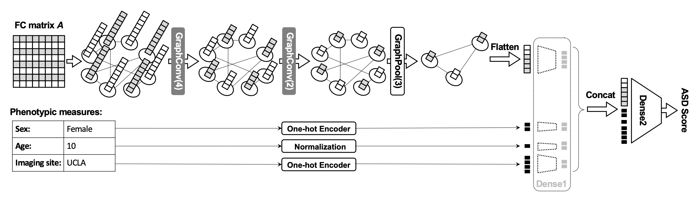

# Graph Convolutional Network (GCN)
We implemented a GCN to predict Autism Spectrum Disorder (ASD) and achieved a ~10% increase in accuracy when compared with the previous best model.

## GCN C²P Model


## The Effect of Graph Convolution & Graph Pooling
The effect on the adjacency matrix A and the feature matrix H


Illustration of the effect on the graph


## Dependencies
  * Tensorflow
  * Pandas
  * Numpy
  * Sklearn
  * tqdm

## Workflow
### 1. Preparation
Convert ABIDE_fc.mat to csv files so that data become easily readable to Python. <br>
Create a directory named "FC_norm". Then, in MatLab, run
```
converter.m
```

### 2. Preprocess and create datasets
Use data.py to generate a pickle file which contains the training, validation, test datasets. This is to make sure the split of datasets is the same across multiple runs of train.py because the data is shuffled before being split.<br>
(Data paths are specified in config.py: <br>
DATA_dir, left_table_file, matrices_dir, pickle_path, upsampled_pickle_path)
```
$ python data.py
```
OR generate dataset according to a json file specifying the split (default "split_ids.json"
```
$ python data_by_json.py
```

### 3. Train model
The datasets are read from [pickle_path] or [upsampled_pickle_path], as specified in config.py
```
$ python train.py
```
OR save model to a specified directory under [ckpt_dir]/[model_idx] where [ckpt_dir] is specified in config.py
```
$ python train.py [model_idx]
```
OR use select_model.sh and run 50 times the above command
```
./select_model.sh
```

### 4. Evaluate model
This evaluates the model saved to [ckpt_dir]
```
$ python eval.py
```
OR use Tensorboard, go to the code root directory and run
```
tensorboard --logdir logs
```

## Note
1. The original data file: ABIDE_fc.mat
2. Model is defined in: model.py
3. recover_ids.py can be used to recover train, val, test split in the form of a json file, "split_ids.json"
